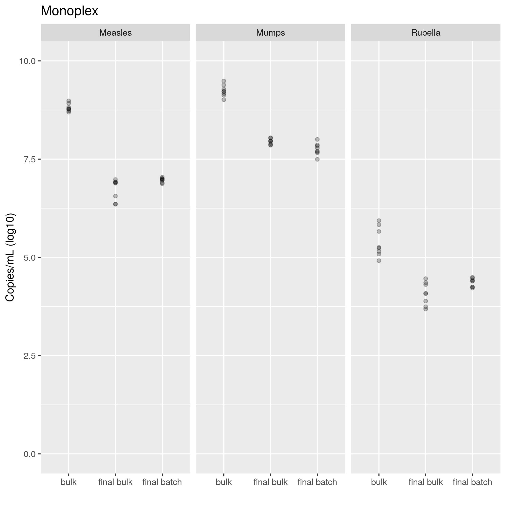
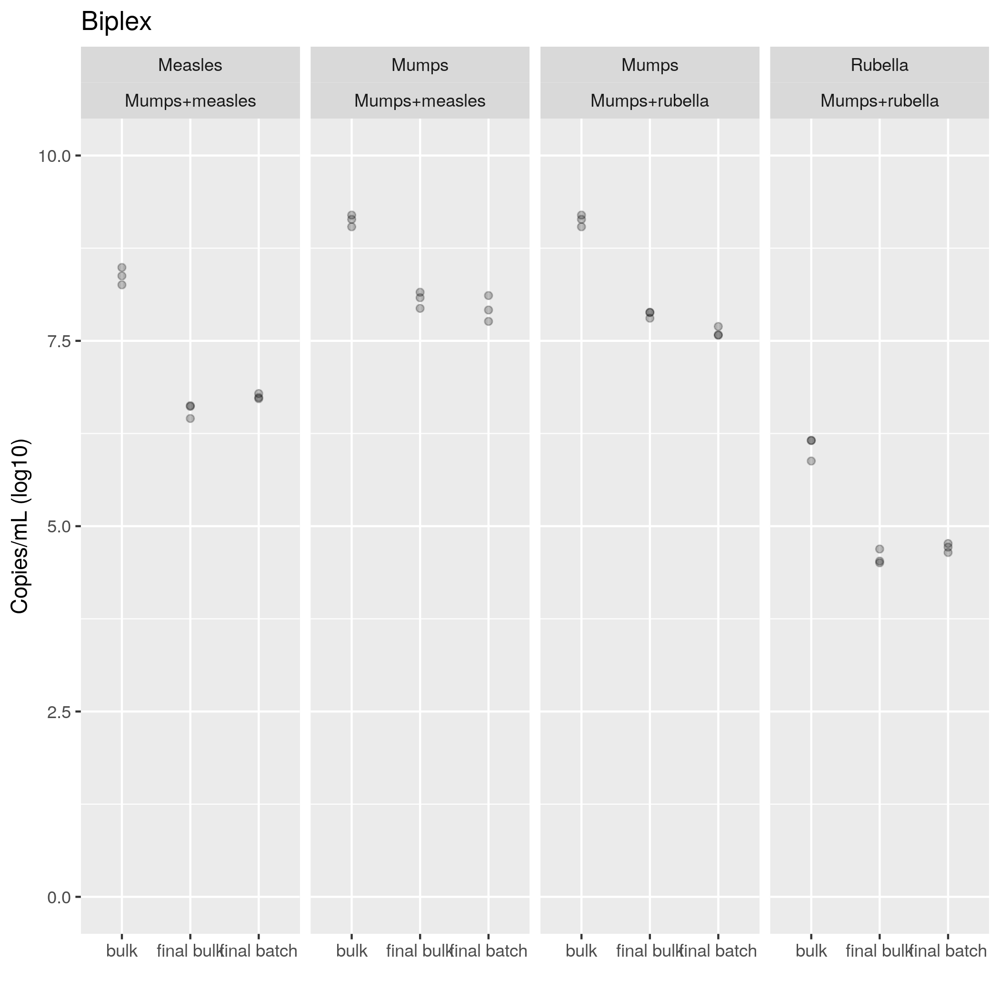

```{r setup, include=FALSE}
knitr::opts_chunk$set(echo = FALSE)
knitr::opts_knit$set(root.dir = normalizePath(".."))
options(scipen = 999)
library(pander)
library(knitr)
library(philsfmisc)
panderOptions('table.style', 'rmarkdown')
```

---

**Histórico do documento**

```{r, echo = FALSE}
Version <- c("01")
Changes <- c("Versão inicial")
history <- cbind(Version, Changes)
colnames(history) <- c("Versão", "Alterações")
pander(history, split.cells = 70)
# kable(history)
```

---

<!-- # Assinaturas -->

```{r, echo=FALSE}
sig.field <- "__________________________"
date.field <- "_____________"
Stat <- c("Elaborador", "Felipe Figueiredo", "Bioestatístico", sig.field, date.field)
Reviewer <- c("Revisado por", "", "", sig.field, date.field)
Approver <- c("Verificado por", "", "", sig.field, date.field)
Final.Approver <- c("Aprovação final", "", "", sig.field, date.field)

sigs <- rbind(
  Stat
  , Reviewer
  , Approver
  , Final.Approver
  )
rownames(sigs) <- NULL
colnames(sigs) <- c("Papel", "Nome", "Função", "Assinatura", "Data")

pander(sigs, split.cells = c(9, 14, 14, 16, 8), split.table = Inf)
# kable(sigs)
```

<!-- # Lista de abreviaturas -->

# Introduction

<!-- ## Objetivos -->

<!-- ## Recepção e tratamento dos dados -->

```{r scripts, include=FALSE}
source("scripts/potency-anova.R")
```

# Methods

**Evaluation of monoplex and biplex assays**

In an initial exploratory analysis, the inspection of the residuals in a classical ANOVA showed the assumption of normality was not strongly violated (no significant values were obtained from the Shapiro-Wilk test, results not shown).
The Levene test, however, indicated the assumption of homogeneity of variances was violated in most monoplex samples tested (p = 0.00002 for Measles, p = 0.25029 for Mumps and p = 0.00761 for Rubella).
We therefore opted to use the same procedure of the Welch correction in all analyses performed.
In the same manner, the Games-Howell post-hoc test was employed to correct for multiple comparisons in the presence of heteroskedasticity.

For the biplex samples, the Levene test did not show evidence of heterogeneity of variances for either Measles (p = `r lev.measles.bi.p`), Mumps (p = `r lev.mumps.bi.p`) or Rubella (p = `r lev.rubella.bi.p`).
For simplicity sake these experiments were analyzed with the same methodology as described above.

**Performance comparison between monoplex and biplex assays**

# Results

```{r tabela geral}
pander(results_table, split.table = Inf, digits = 3)
```

Table: **Table 6** Potency of vaccine presentations quantified by monoplex and multiplex qPCR
method.
The p-values presented correspond to Welch-ANOVA tests comparing different vaccine formulation stages, per Virus and qPCR mixture.

## Evaluation of monoplex and biplex assays

As expected, a major titer drop was observed with the three vaccine virus strains, between the three formulations (bulk, final bulk and final batch).
This effect was observed when using both the Monoplex technique
(p = `r welch.aov.measles.mono.p`, p = `r welch.aov.mumps.mono.p` and p = `r welch.aov.rubella.mono.p` for Measles, Mumps and Rubella, respectively),
and the Biplex technique
(p = `r welch.aov.measles.bi.p`, p = `r welch.aov.mumps.m.bi.p`, p = `r welch.aov.mumps.r.bi.p`,  and p = `r welch.aov.rubella.bi.p` for Measles, Mumps coupled with Measles, Mumps coupled with Rubella and Rubella, respectively).



**Measles**

There were significant differences between the vaccine groups considered
(Welch ANOVA, p = `r welch.aov.measles.mono.p`).
We observed an average decrease of
`r abs(gh.measles.mono$intermediate$posthoc["final bulk-bulk", 1])`
copies/PCR (log10) in final vaccine bulk, when compared to the bulk vaccine
(Games-Howell test, p `r gh.measles.mono.p[1]`),
and an average decrease of
`r abs(gh.measles.mono$intermediate$posthoc["final batch-bulk", 1])`
copies/PCR (log10) in final vaccine batch, when compared to the bulk vaccine
(Games-Howell test, p `r gh.measles.mono.p[2]`).
When comparing the two tested vaccine groups (final bulk and final batch), there was no significant difference
(Games-Howell test, p = `r gh.measles.mono.p[3]`).

**Mumps**

There were significant differences between the vaccine groups considered
(Welch ANOVA, p `r welch.aov.mumps.mono.p`).
We observed an average decrease of
`r abs(gh.mumps.mono$intermediate$posthoc["final bulk-bulk", 1])`
copies/PCR (log10) in final vaccine bulk, when compared to the bulk vaccine
(Games-Howell test, p `r gh.mumps.mono.p[1]`),
and an average decrease of
`r abs(gh.mumps.mono$intermediate$posthoc["final batch-bulk", 1])`
copies/PCR (log10) in final vaccine batch, when compared to the bulk vaccine
(Games-Howell test, p `r gh.mumps.mono.p[2]`).
When comparing the two tested vaccine groups, there is also a significant difference
(Games-Howell test, p = `r gh.mumps.mono.p[3]`),
indicating an average decrease of
0.1945
Copies/PCR (in log10) in the final batch preparation compared to the final bulk preparation.

**Rubella**

There were significant differences between the vaccine groups considered
(Welch ANOVA, p = `r welch.aov.rubella.mono.p`).
We observed an average decrease of
`r abs(gh.rubella.mono$intermediate$posthoc["final bulk-bulk", 1])`
copies/PCR (log10) in final vaccine bulk, when compared to the bulk vaccine
(Games-Howell test, p = `r gh.rubella.mono.p[1]`),
and an average decrease of
`r abs(gh.rubella.mono$intermediate$posthoc["final batch-bulk", 1])`
copies/PCR (log10) in final vaccine batch, when compared to the bulk vaccine
(Games-Howell test, p = `r gh.rubella.mono.p[2]`).
When comparing the two tested vaccine groups (final bulk and final batch), there was no significant difference
(Games-Howell test, p = `r gh.rubella.mono.p[3]`).



**Measles**

The Measles sample had significant titer drops from the bulk to both final bulk and final batch formulations (Games-Howell test p = `r gh.measles.bi.p[1]` and p = `r gh.measles.bi.p[2]`, respectively).
When testing for differences final bulk and final batch, we found no significant difference in titers (p = `r gh.measles.bi.p[3]`).

**Mumps**

In both Mumps mixtures tested (mixed with Measles and with Rubella), there were significant drops in viral titer from the bulk to other formulations (p = `r gh.mumps.m.bi.p[1]` and p = `r gh.mumps.m.bi.p[2]` for Measles, and p = `r gh.mumps.r.bi.p[1]` and p = `r gh.mumps.r.bi.p[2]` for Rubella).
Mean titer was also not different in both mixtures (p = `r gh.mumps.m.bi.p[3]` for Measles mixture and p = `r gh.mumps.r.bi.p[3]` for Rubella mixture).

**Rubella**

Rubella was tested in a mixture with Mumps, where there was significant titer drops frin the bulk to the two other formulations (p = `r gh.rubella.bi.p[1]` and p = `r gh.rubella.bi.p[2]`, respectively).
No significant difference was detected between the final bulk and final batch formulations (p = `r gh.rubella.bi.p[3]`).

## Performance comparison between monoplex and biplex assays

<!-- # Exceções e Desvios do teste -->

# Conclusions

# References

<!-- # Apêndice -->

