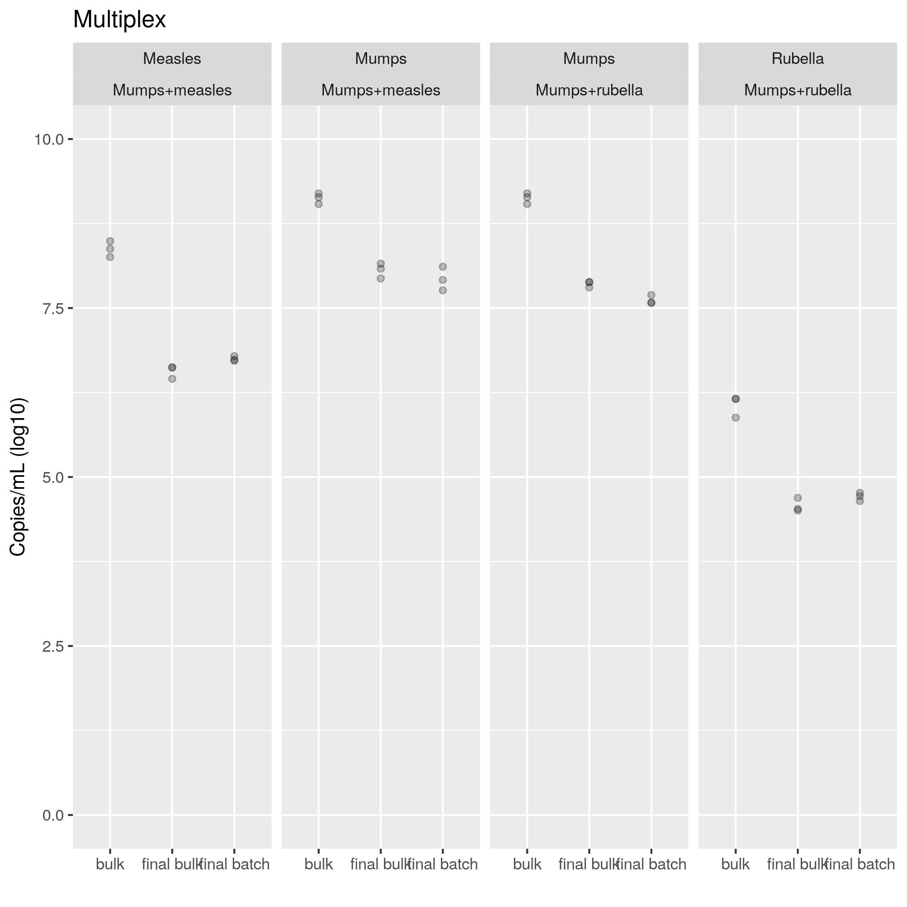

---

**Histórico do documento**

| Versão |   Alterações   |
|:------:|:--------------:|
|   01   | Versão inicial |

---

<!-- # Assinaturas -->

|      Papel      |       Nome        |     Função     |         Assinatura         |     Data      |
|:---------------:|:-----------------:|:--------------:|:--------------------------:|:-------------:|
|   Elaborador    | Felipe Figueiredo | Bioestatístico | __________________________ | _____________ |
|  Revisado por   |                   |                | __________________________ | _____________ |
| Verificado por  |                   |                | __________________________ | _____________ |
| Aprovação final |                   |                | __________________________ | _____________ |

<!-- # Lista de abreviaturas -->

# Introduction

<!-- ## Objetivos -->

<!-- ## Recepção e tratamento dos dados -->

# Methods

**Evaluation of monoplex and multiplex assays**

In an initial exploratory analysis, the inspection of the residuals in a classical ANOVA showed the assumption of normality was not strongly violated (no significant values were obtained from the Shapiro-Wilk test, results not shown).
The Levene test, however, indicated the assumption of homogeneity of variances was violated in most monoplex samples tested (p = 0.00002 for Measles, p = 0.25029 for Mumps and p = 0.00761 for Rubella).
We therefore opted to use the same procedure of the Welch correction in all analyses performed.
In the same manner, the Games-Howell post-hoc test was employed to correct for multiple comparisons in the presence of heteroskedasticity.

For the multiplex samples, the Levene test did not show evidence of heterogeneity of variances for either Measles (p = 0.34015), Mumps (p = 0.10204) or Rubella (p = 0.13186).
For simplicity sake these experiments were analyzed with the same methodology as described above.

**Performance comparison between monoplex and multiplex assays**

As well as vertical comparisons between different per-virus formulations (Table 6), we performed a global horizontal comparizon between the two mixtures tested in this study (Table 7) using the same methodology described above.
This was decided in order to allow for a reference of comparison between all results in this study.

# Results

## Evaluation of monoplex and multiplex assays

As expected, a significant titer change was observed between the three formulations (bulk, final bulk and final batch), with the three vaccine virus strains.
This effect was observed when using both the Monoplex assay
and the Multiplex assay
(table 6).
Pairwise post-tests confirm a major titer drop can be consistently detected from the initial bulk formulation the next processing stages in all scenarios evaluated, as described below.
Figure 2 shows the results for the Monoplex assay and Figure 3 shows the mixtures tested in the Multiplex assay.

<!-- monoplex -->
<!-- (p = < 0.00001, p = < 0.00001 and p = 0.00003 for Measles, Mumps and Rubella, respectively), -->
<!-- multiplex -->
<!-- (p = 0.00036, p = 0.00057, p = 0.00007,  and p = 0.00097 for Measles, Mumps coupled with Measles, Mumps coupled with Rubella and Rubella, respectively). -->

| qPCR Mixture  | Virus Target | Monovalent Bulk | Final Vaccine Bulk | Final Vaccine Batch |     p     |
|:-------------:|:------------:|:---------------:|:------------------:|:-------------------:|:---------:|
|   Monoplex    |   Measles    |      8.81       |        6.73        |        6.97         | < 0.00001 |
|   Monoplex    |    Mumps     |      9.24       |        7.95        |        7.75         | < 0.00001 |
|   Monoplex    |   Rubella    |      5.38       |        4.08        |        4.36         |  0.00003  |
| Mumps+measles |   Measles    |      8.37       |        6.56        |        6.75         |  0.00036  |
| Mumps+measles |    Mumps     |      9.12       |        8.06        |        7.93         |  0.00057  |
| Mumps+rubella |    Mumps     |      9.12       |        7.86        |        7.62         |  0.00007  |
| Mumps+rubella |   Rubella    |      6.06       |        4.58        |        4.71         |  0.00097  |

Table: **Table 6** Potency of vaccine presentations quantified by monoplex and multiplex qPCR
method.
The p-values presented correspond to Welch-ANOVA tests comparing different vaccine formulation stages, per Virus and qPCR mixture.
Monovalent Bulk indicated in both Mumps Multiplex mixtures originate from the same experiment.

**Measles**

The Measles sample had significant titer drops from the bulk to both final bulk and final batch formulations
in the monoplex assay
(Games-Howell test, p < 0.00001 and p < 0.00001, respectively),
and in the multiplex assay
(Games-Howell test, p = 0.00011 and p = 0.00131, respectively).
When testing for differences between the final bulk and final batch, we found no significant difference in titers in either the
monoplex (Games-Howell test, p = 0.09923) or the
multiplex assay (Games-Howell test, p = 0.12683).

**Mumps**

The Mumps virus Monoplex assay had significant titer drops from the bulk to both final bulk and final batch formulations
(Games-Howell test, p < 0.00001 and p < 0.00001, respectively).
In both Mumps Multiplex mixtures tested, there were significant drops in viral titer from the bulk to other formulations
(Games-Howell test, p = 0.00067 and p = 0.00468 for Measles mixture,
and p = 0.00025 and p = 0.00006 for Rubella mixture).
These two multiplex mixtures were compared to a single Monovalent Bulk experiment (table 6 and figure 3).

There was an average decrease of
0.1945
log10 Copies/PCR in the final batch preparation when compared to the final bulk
(Games-Howell test, p = 0.02198).
Such difference in titer was not observed in the Multiplex assay for either
Measles mixture (Games-Howell test, p = 0.58129)
or the for
Rubella mixture (Games-Howell test, p = 0.01966).

**Rubella**

The Rubella sample had significant titer drops from the bulk to both final bulk and final batch formulations
in the Monoplex assay
(Games-Howell test, p = < 0.00001 and p = 0.00017, respectively),
and in the Multiplex assay
(Games-Howell test, p = 0.00099 and p = 0.00361, respectively).
When comparing the two tested vaccine groups (final bulk and final batch), there was no significant difference in either
the monoplex assay, nor in the multiplex mixture with Mumps virus
(Games-Howell test, p = 0.06272 and  p = 0.25792, respectively).

## Performance comparison between monoplex and multiplex assays

| Virus Target | Monoplex Assay | Multiplex Assay |    p    |
|:------------:|:--------------:|:---------------:|:-------:|
|   Measles    |     7.504      |      7.229      | 0.44265 |
|    Mumps     |     8.314      |      8.285      | 0.88968 |
|   Rubella    |     4.607      |      5.116      | 0.08458 |

Table: **Table 7** Comparison of vaccine potency by qPCR assay method.
The p-values presented correspond to Welch-ANOVA tests comparing the monoplex assays with the multiplex assays, per Virus.

When comparing the performance of the monoplex and multiplex mixtures (as seen in Table 7) there were no significant evidence of diference in mean titers for
the measles virus (Welch-ANOVA p = 0.44265),
the mumps virus (Welch-ANOVA p = 0.88968) and
the rubella virus  (Welch-ANOVA p = 0.08458),
so no post-hoc tests were performed.
This result indicates tha both the monoplex and multiplex PCR mixtures may have similar performances when used to test for vaccine formulation potency.
If larger experiments confirm this initial result, the choice on what mixture to use could be then performed solely on laboratory logistics issues, as oposed to experimental performance issues.

<!-- # Exceções e Desvios do teste -->

# Conclusions

# References

<!-- # Apêndice -->

