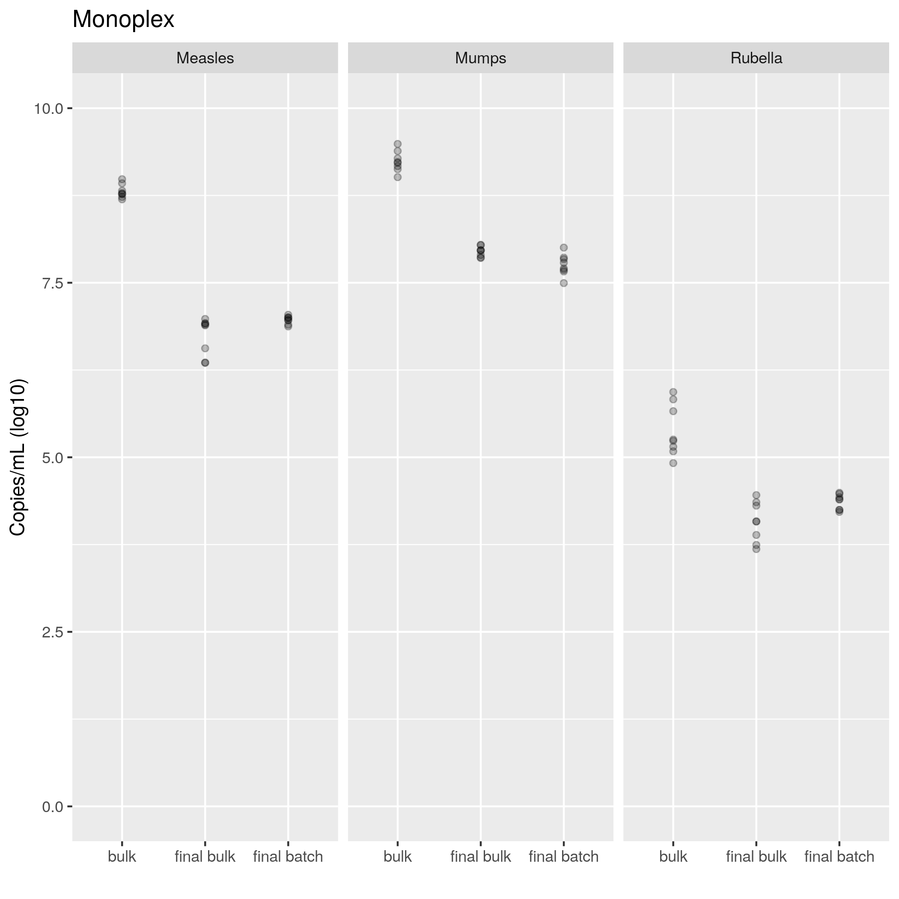

# Methods

In an initial exploratory analysis, the inspection of the residuals in a classical ANOVA showed the assumption of normality was not strongly violated (no significant values were obtained from the Shapiro-Wilk test, results not shown).
The Levene test, however, indicated the assumption of homogeneity of variances was violated in most cases (p = 0.00002 for Measles, p = 0.25029 for Mumps and p = 0.00761 for Rubella).
We therefore opted to use the same procedure of the Welch correction in all analyses performed.
In the same manner, the Games-Howell post-hoc test was employed to correct for multiple comparisons in the presence of heteroskedasticity.

# Results

OBSERVAÇÃO: TRADUÇÕES UTILIZADAS

- bulk mono = bulk
- vacina formulada = final bulk
- vacina liofilizada = final batch

CONFERIR!

## Measles

There were significant differences between the vaccine groups considered (Welch ANOVA, p < 0.00001).
We observed an average decrease of 2.0745 copies/PCR (log10) in final vaccine bulk, when compared to the bulk vaccine (Games-Howell test, p < 0.00001), and an average decrease of 1.8423 copies/PCR (log10) in final vaccine batch, when compared to the bulk vaccine (Games-Howell test, p < 0.00001).
When comparing the two tested vaccine groups (final bulk and final batch), there was no significant difference (Games-Howell test, p = 0.09923).

## Mumps

There were significant differences between the vaccine groups considered (Welch ANOVA, p < 0.00001).
We observed an average decrease of 1.2904 copies/PCR (log10) in final vaccine bulk, when compared to the bulk vaccine (Games-Howell test, p < 0.00001), and an average decrease of 1.4848 copies/PCR (log10) in final vaccine batch, when compared to the bulk vaccine (Games-Howell test, p < 0.00001).
When comparing the two tested vaccine groups, there is also a significant difference (Games-Howell test, p = 0.02198), indicating an average decrease of 0.1945 Copies/PCR (in log10) in the final batch preparation compared to the final bulk preparation.

## Rubella

There were significant differences between the vaccine groups considered (Welch ANOVA, p = 0.00003).
We observed an average decrease of 1.3083 copies/PCR (log10) in final vaccine bulk, when compared to the bulk vaccine (Games-Howell test, p = 0.00002), and an average decrease of 1.0209 copies/PCR (log10) in final vaccine batch, when compared to the bulk vaccine (Games-Howell test, p = 0.00035).
When comparing the two tested vaccine groups (final bulk and final batch), there was no significant difference (Games-Howell test, p = 0.06272).
